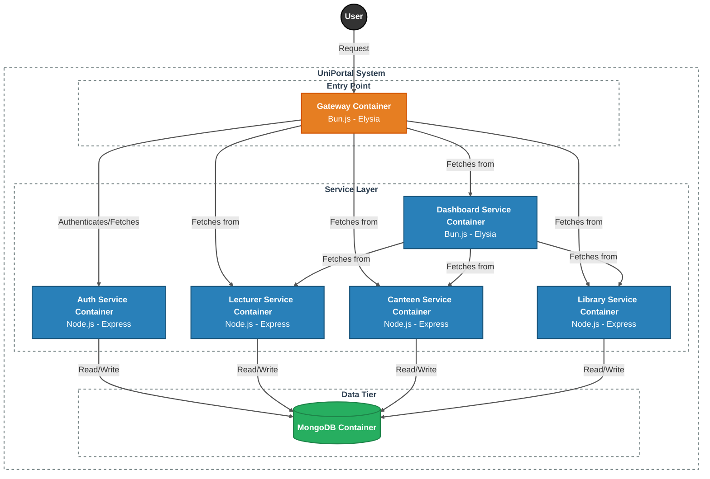

## System Architecture



---

## Getting Started

Install:

- Docker
- Docker Compose

1. Clone the repo

```bash
git clone https://github.com/thaminuZs/uni-portal-microservices.git

cd uni-portal-microservices/src
```
2. Configure Environment Variables and JWT Keys on docker-compose.yml

3. Build and Start Containers
```bash
docker compose build

docker compose up -d
```

---

## API Endpoints

### Base URL
> localhost:5000/api

---

### DashBoard APIs
> /api/dashboard

**Get Dashboard Info**
> GET /api/dashboard

---

### Auth Service APIs
> /api/auth

**Register User**
> POST /api/auth/register

```json
{
    "name": "thami",
    "email": "thami@mail.com",
    "password": "123456",
    "role": "student"
}
```

**Login User**
> POST /api/auth/login
```json
{
    "email": "thami@mail.com",
    "password": "12345"
}
```

---

### Lecturer Service APIs
> /api/lecturers

**Get All Lecturers**
> GET /api/lecturers

**Get Lecturer By ID**
> GET /api/lecturers/:id

**Create Lecturer**
> POST /api/lecturers

```json
{
  "name": "Dr. Kayanan",
  "department": "Physical Science",
  "email": "kayanan@vau.edu",
  "lastSeen": "2026-05-10"
}
```

**Update Lecturer**
> PUT /api/lecturers/:id

**Delete Lecturer**
> DELETE /api/lecturers/:id

**Mark Attendance**
> POST /api/lecturers/:id/attendance

```json
{
  "status": "present"
}
```

**Get Attendance Logs**
> GET /api/lecturers/:id/attendance

---

### Canteen Service APIs
> /api/canteens

**Get All Canteens**
> GET /api/canteens

**Get Single Canteen**
> GET /api/canteens/:id

**Create Canteen**
> POST /api/canteens

```json
{
  "name": "ammachchi",
  "menu": ["puri", "vade"],
  "currentQueue": "mid",
  "updatedAt": "2026-05-10T12:00:00"
}
```

**Update Menu**
> PATCH /api/canteens/:id/menu

```json
{
  "menu": ["rice", "thosai"]
}
```

**Report Queue Status**
> POST /api/canteens/:id/queue

```json
{
  "level": "high"
}
```

**Get Queue History**
> GET /api/canteens/:id/queue/logs

---

### Library Service APIs
> /api/libraries

**Get All Libraries**
> GET /api/libraries

**Get Single Library**
> GET /api/libraries/:id

**Create Library**
> POST /api/libraries

```json
{
  "name": "main",
  "capacity": 300,
  "currentOccupancy": 100,
  "status": "moderate",
  "updatedAt": "2025-05-10T11:05:20"
}
```

**Update Occupancy**
> POST /api/libraries/:id/occupancy

```json
{
  "count": 320
}
```

**Get Occupancy Logs**
> GET /api/libraries/:id/occupancy/logs

---

### Logs Viewer

_This project uses Dozzle for realtime Docker log monitoring_

> localhost:8888

---